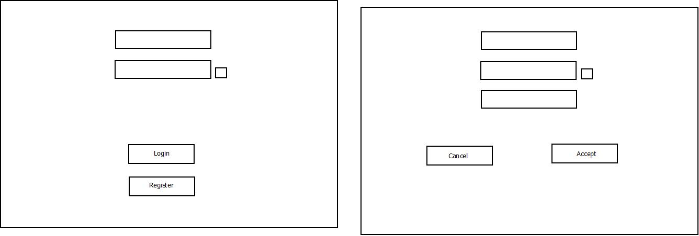
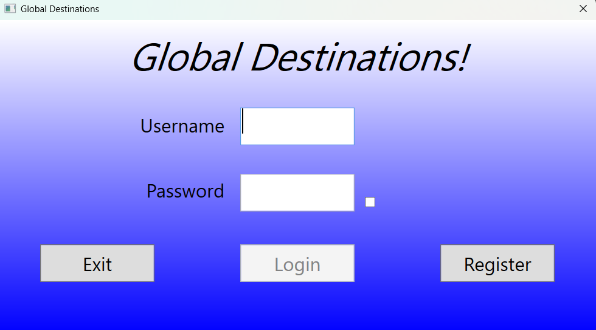
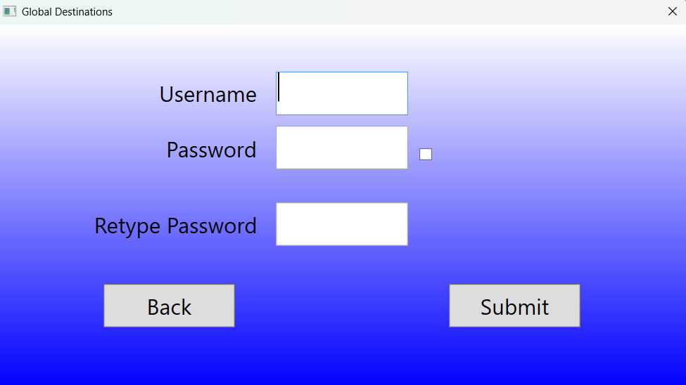
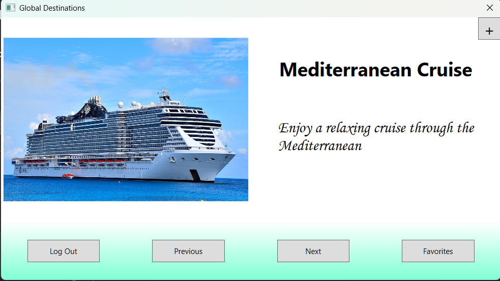
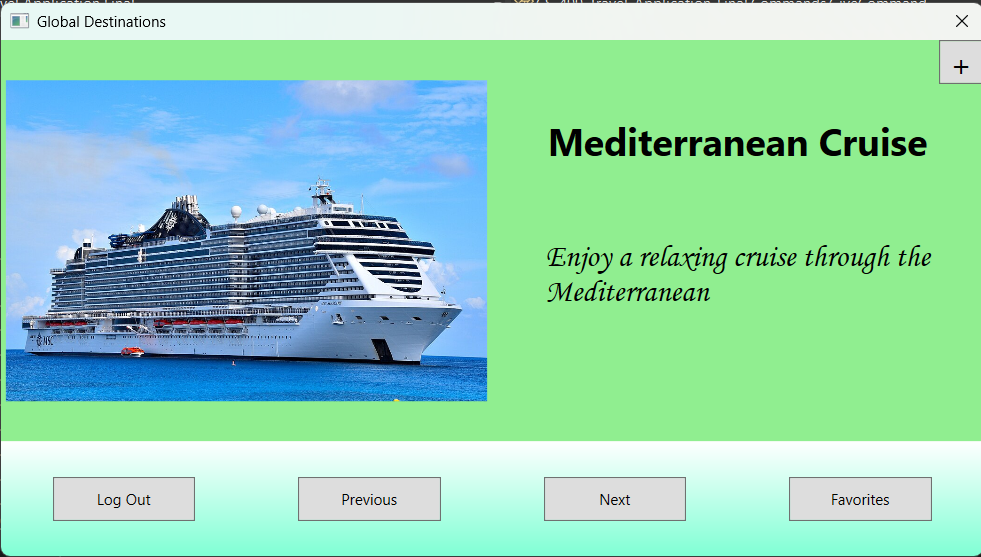
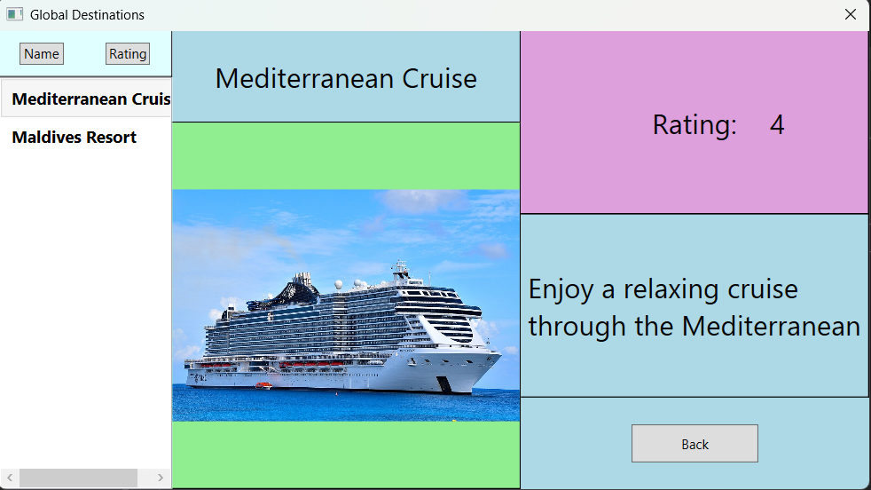

<h1>Hi, I'm Jonathon Scofield  <a href="https://github.com/jdscofield">Programmer</a>, <a href="www.linkedin.com/in/jdsco45">Lab Administrator</a></h1>
 

I currently work in a datacenter as a lab administrator for a larger company. I also have a wife and an almost 1 year old daughter who are everything to me. My career goals are to transition more into the software development area of the tech industry, as currently I tend to work mostly with hardware. I am finishing up my Bachelor's in Computer Science with a concentration in Data Analytics at SNHU, and had previously gotten my Associates in Computer Programming from a local community college.

<h2>Languages that I have experience in:</h2>
<lo>
  <li>HTML</li>
  <li>C#</li>
  <li>Java</li>
  <li>Python</li>
  <li>C++</li>
  <li>Visual Basic</li>
</lo>

 I also have some experience with databases, both SQL and NOSQL

<h2>Professional Development Through SNHU</h2>

Through my time studying at SNHU I have learned a great deal not only about science, math, and computing but also about myself. I have been challenged by assignments that before I didn't think that I would be able to work through, but was able to overcome through diligence and hard work. I have learned a lot about not only how to make computers function the way that we want them to, but also why they function the way that they do and how the applications are woven together. I have learned about how projects are designed and created in a workplace environment and how collaboration can lead to faster and more functional results than working alone. My knowledge of the industry and of the latest and upcoming technological advancements has allowed me to better look at the career options that I have available to me and how I might be able to make an impact in the industrty and in the world.

<h2>👨‍💻 Software Development Projects:</h2>

<h3>Capstone Project CS499</h3>

A link to the Full project files can be found here: 
<a href="https://github.com/jdscofield/CS-499-Travel-Application-Final">Final Capstone Project</a>
 

For my project I took an application that allowed users to scroll through multiple different exotic destinations and read information about them, and decided to turn this into a full application that could satisfy all of the requirements of the project.

<h2>Informal Code Review Of Original Application:</h2>

<h2>Full Code Review of Revised Application:</h2>
)

For application design I chose C# with WPF for the gui. I had never used WPF before and so it was a learning experience not only for designing the gui itself but also for figuring out how the application's elements connected to the graphical interfaces. For the database I chose SQLite in order to store the user and trip information, and to show different algorithms I created a sorting algorithm to sort the favorited destinations by either their rating or by their name.

<h2>Application Design</h2>

When I started working on the application I first drew up a design of how I wanted the application to function generally:

For the application's design I broke it down into three major pages, all rendering on top of a window. The login page is the first page to come up and includes a textbox and passwordbox for the user login. In order to give the user the option of seeing the password's letters or not I added a checkbox that actually flips between using a passwordbox for password input and using a textbox for password input.

 

The user can then go to a register screen that will allow them to create a new user. The register screen takes in the desired username as well as the desired password, and then hashes the password. The username and hashed password are then stored in the application's database so that they can be accessed later.

 

Once logged in, the user accesses a page that holds the full list of destinations. The destinations are shown one at a time, with an image related to the destination as well as the title and description of the destination. The rating of the destination is also shown so that the user has an idea of how good the destinations are in comparison to each other.

 

If the user clicks the button with the "+" sign on it in the top right of the page then the currently viewed destination is added to that user's favorites list. The acknoledgement of this is done by turning the background of the destination information green.

 

The user can then go to the favorites page, where the destinations that they favorited are listed in a listbox on the side of the screen. Selecting the favorite destination will bring up the destination information. The destinations can also be sorted here by either name or rating by using the buttons above the listbox.

 
 
<h2>Sorting Algorithm</h2>

The sorting algorithm that I used was a quicksort. This was used because it can scale up to large datasets easily and is very fast and efficient at sorting elements. The quicksort divides that list of elements and sorts the divided elements before putting them back together. This reduces that amount of processing needed to perform the actual sort as the list of elements is broken down into smaller pieces that can be tackled individually. In order to get the sorting algorithm to function I first had to overload the operators for the Trip class, which is the class that holds the information about the destinations. by overloading the '<', '>', '<=', '>=', '==' operators I could enable two Trip objects to be easily compared to each other. The speed of the algorithm averages at O(n log n), though in the worst case it can go down to O(n^2)

<h2>Database</h2>

Initially I attempted to create a cloud-based sql database using Azure, however I had issues with getting the application to connect to Azure and with making sure that all users had access to the online database. Because of this I switched the implementation to a local SQLite database included with the applicaiton. This allows the data to travel with the application and also be organized and easily accessible. The database is broken up into three tables: the user database which stores the user information including username and password, the destination table which stores information about the destinations including the title, description, and rating, and the userDestination table, which is the connecting table. The userDestination table not only prevents a many-to-many relationship between the user and destination tables, but also shows which destinations have been favorited by the user.

<h2>Journal Entries on the Progress of Development</h2>

The following are journal entries made as I worked through the development of the capstone project: 

<lo>
  <li><a href="CS 499 Module One Assignment - Jonathon Scofield.docx">Module 1 Journal</a></li>
  <li><a href="CS 499 Module 2 Journal.docx">Module 2 Journal</a></li>
  <li><a href="CS 499 Module 3 Journal.docx">Module 3 Journal</a></li>
  <li><a href="CS 499 Module 4 Journal.docx">Module 4 Journal</a></li>
  <li><a href="CS 499 Module 5 Journal.docx">Module 5 Journal</a></li>
  <li><a href="CS 499 Module Six Journal.docx">Module 6 Journal</a></li>
</lo>

<h2>Informal Code Review:</h2>

[][linkedin]

[linkedin]: www.linkedin.com/in/jdsco45

<!--
**
Here are some ideas to get you started:

- 🔭 I’m currently working on ...
- 🌱 I’m currently learning ...
- 👯 I’m looking to collaborate on ...
- 🤔 I’m looking for help with ...
- 💬 Ask me about ...
- 📫 How to reach me: ...
- 😄 Pronouns: ...
- ⚡ Fun fact: ...
-->

<!--
**jdscofield/jdscofield** is a ✨ _special_ ✨ repository because its `README.md` (this file) appears on your GitHub profile.

Here are some ideas to get you started:

- 🔭 I’m currently working on ...
- 🌱 I’m currently learning ...
- 👯 I’m looking to collaborate on ...
- 🤔 I’m looking for help with ...
- 💬 Ask me about ...
- 📫 How to reach me: ...
- 😄 Pronouns: ...
- ⚡ Fun fact: ...
-->
